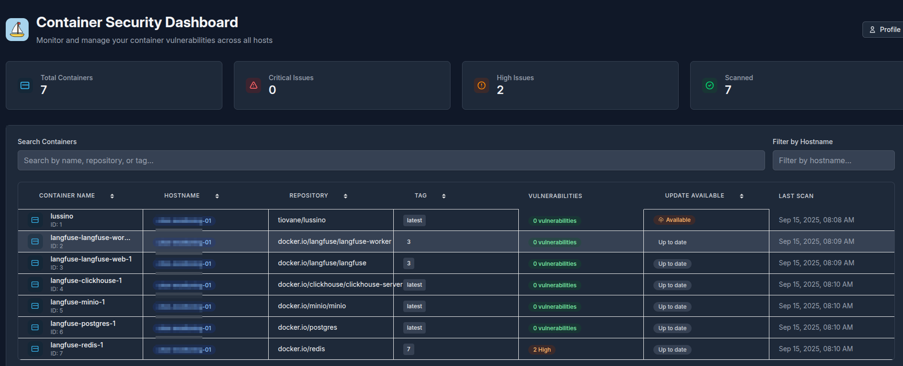

# Lussino

A lightweight and simple container vulnerability scanning platform that helps organizations monitor and secure their containerized applications using **Grype**.



## Key Highlights

- **Zero-Dependency Agent**: Lightweight bash script requiring no installation or dependencies
- **Single Container Deployment**: Entire application runs in one Docker container
- **Minimal Footprint**: Easy deployment across any environment

## Features

- **Container Discovery**: Automatic detection and inventory of containers across hosts
- **Vulnerability Scanning**: Integration with Grype for comprehensive security analysis
- **Risk Assessment**: Visual risk scoring (0-100) with color-coded severity indicators
- **Dashboard Analytics**: Real-time statistics and vulnerability trends
- **Dark/Light Theme**: Full theme support with system preference detection
- **User Management**: Authentication with password change functionality

## Deployment

Create a `docker-compose.yml` file:

```yaml
services:
  lussino:
    image: tiovane/lussino:latest
    container_name: lussino
    ports:
      - "3007:3000"
    volumes:
      - ./data:/app/data
    environment:
      NODE_ENV: production
      APP_URL: "http://localhost:3000"
      # generate with openssl rand -hex 32
      AGENT_TOKEN: "1234"
      # Lussino will not save vulnerabilities with a risk % below IGNORE_RISK_BELOW
      IGNORE_RISK_BELOW: 10
      # Container scan cron job schedule
      SCAN_CRON_STRING: "0 2 * * *"
    restart: unless-stopped
    healthcheck:
      test: ["CMD", "curl", "-f", "http://localhost:3000/healthz"]
      interval: 30s
      timeout: 10s
      retries: 3
```

Deploy with:
```bash
docker-compose up -d
```

Default credentials: admin / changeme
Be sure to change the password in the profile page

### Option 4: Development Setup
```bash
# Server
cd server && bun install && bun run dev

# Frontend  
cd frontend && bun install && bun run dev
```

## Agent Deployment

Deploy the scanning agent on any host with Docker - **no dependencies required** (except of course docker):

### First-Time Setup

The agent uses an interactive configuration process on first run:

```bash
# Download agent directly from GitHub
wget https://raw.githubusercontent.com/tommaso-iovane/Lussino/refs/heads/main/agent/agent.sh
chmod +x agent.sh

# Run for first-time setup (will prompt for configuration)
./agent.sh
```

The agent will prompt you for:
- **Server endpoint** (required): Your Lussino server URL (e.g., `http://your-server:3000`)
- **Authentication token** (optional): Leave blank if not using authentication  
- **Custom hostname** (optional): Override system hostname for identification

Configuration is saved to `~/.config/lussino/config` and can be edited manually or deleted to reconfigure.

### Manual Configuration

You can also create the configuration file manually:

```bash
# Create configuration directory
mkdir -p ~/.config/lussino

# Create configuration file
cat > ~/.config/lussino/config << EOF
LUSSINO_SERVER_ENDPOINT="http://your-lussino-server:3000"
LUSSINO_AUTH_TOKEN="your-auth-token"
AGENT_HOSTNAME="custom-hostname"
EOF

# Set secure permissions
chmod 600 ~/.config/lussino/config
```

### Automated Scanning with Crontab

Set up automatic vulnerability scanning:

```bash
# Download and install agent
wget -O ./lussino-agent.sh https://raw.githubusercontent.com/tommaso-iovane/Lussino/refs/heads/main/agent/agent.sh
chmod +x ./lussino-agent.sh

# Configure the agent (run once to set up configuration)
./lussino-agent.sh

# Add to crontab for daily scans at 4 AM
echo "0 4 * * * PATH_TO_LUSSINO_AGENT/lussino-agent.sh" | crontab -

# Or edit crontab manually
crontab -e
# Add: 0 4 * * * /opt/lussino/lussino-agent.sh
```

